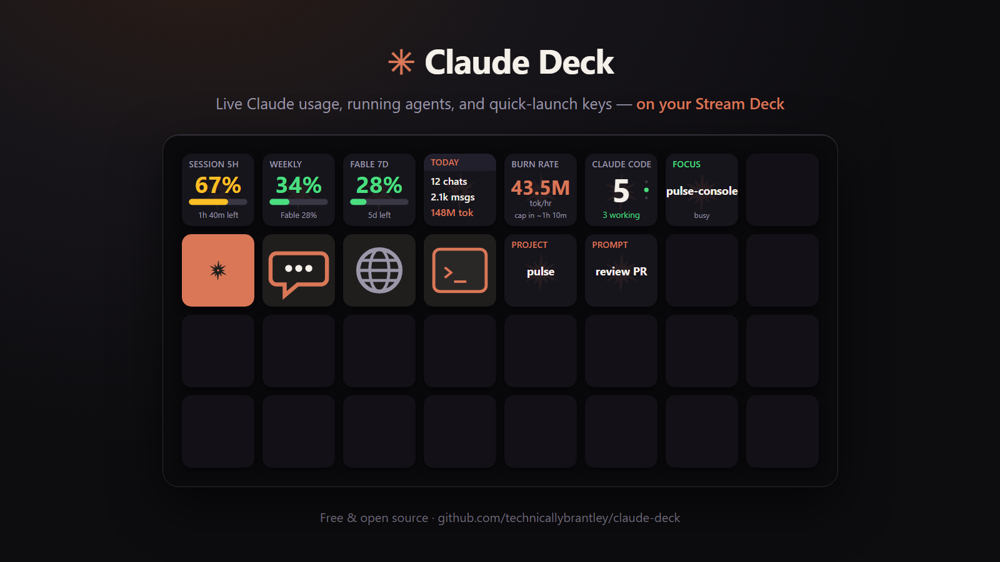
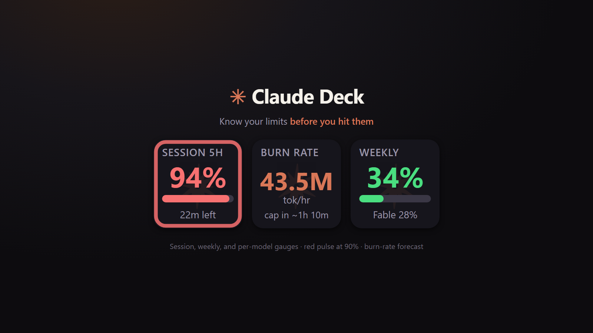
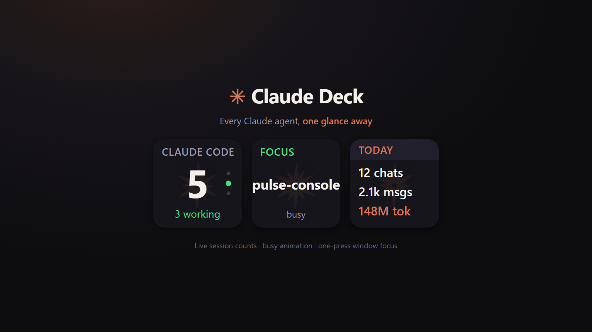

# Claude Deck — Stream Deck plugin

[](https://github.com/tapparello/claude-deck/actions/workflows/ci.yml)

Live Claude usage gauges, running Claude Code sessions, per-session status, and quick-launch keys for the Elgato Stream Deck (Windows and macOS).

The usage gauges show the **same session/weekly percentages Claude Desktop and Claude Code's `/usage` display** — pulled with your local Claude sign-in, refreshed every couple of minutes. No extra login, nothing leaves your machine.



## Keys

| Key | What it shows / does |
|---|---|
| **Session 5h** | On a subscription: the live 5-hour limit % ring + reset countdown. On accounts without one (Foundry/Bedrock/Vertex): **local spend over the last 5 hours** — press to toggle **cost ↔ tokens** (total, with the input/output split beneath). Set a **Budget $** in the key's settings to turn the cost view into a % ring. |
| **Weekly** | On a subscription: the weekly limit % ring + per-model weekly % underneath. Otherwise: **local spend over the last 7 days** — press to toggle **cost ↔ tokens**, with an optional **Budget $** ring. |
| **Today** | Today's Claude Code activity: chats, messages, tokens. |
| **Sessions** | Count of running Claude Code sessions and how many are busy — or **"N needs you"** when a session is blocked on a prompt (5s refresh). Press to cycle per-session details. |
| **Launch Claude Desktop** | Opens the Claude Desktop app (Microsoft Store install auto-detected). |
| **Quick Chat** | Fires Claude's global quick-chat hotkey (Ctrl+Alt+Space). |
| **Open claude.ai** | New chat in your browser. |
| **Claude Code Terminal** | Opens a terminal running `claude` in `Documents\GitHub` (falls back to your home folder). |
| **Model Usage (weekly)** | On a subscription: per-model weekly limit %. Otherwise: **local 7-day spend for that model family** (opus / sonnet / haiku / fable), with an optional **Budget $** ring. **Press to rotate through the models** (`2/3` shows where you are); the settings field just picks the starting one. |
| **Burn Rate** | Tokens/hour over the last hour. On a subscription, plus the estimated time to the 5h cap ("cap in ~1h 20m" / "steady"); otherwise your local spend over the last 5 hours. |
| **Usage** | Local Claude Code token volume + estimated cost over a window (Today / Month-to-date / 7-day, set per key). Press to toggle cost ↔ tokens (the token view shows the input/output split). Cost is an estimate (`est`). Especially useful on enterprise/Foundry accounts, which have no subscription percentages. For accurate cost, enter your exact per-model input/output $/M-token rates in the key's settings (shared across all Usage keys; blank = standard-rate default). |
| **Project Terminal** | Configurable: opens Claude Code in a specific project folder (label + path in key settings). |
| **Focus Session** | Press to cycle running sessions and bring each one's window to the front. When a session is waiting on you it takes priority, so the first press lands on the one that needs an answer. |
| **Quick Prompt** | Configurable: opens quick chat and pastes a canned prompt (optionally presses Enter). Overwrites the clipboard. |
| **Claude Custom** | A Claude-styled spare key that opens anything you set: app, URL, or folder. |
| **Claude Waiting** | Dark ("all clear") until a Claude Code session is waiting on you, then shows that session's name, why (permission prompt / input needed) and a count if several are waiting. Press to jump straight to that session's window; press again to cycle the rest. |
| **Claude Status** | Live state of one Claude Code session: **Needs approval** (blocked on a permission prompt) · **Input needed** · **Working** · **Finished** · **Idle**, with the reason or age underneath. Press to jump to that session's window. Two ways to use it: **bind it to a project** (folder name, in the key's settings) so it always tracks that project, or **leave it blank (auto)** — then a row of auto keys covers your busiest sessions, most-urgent first, ordered by key position (top-left = most urgent). Extra auto keys beyond the session count read "no session". Optional **"Press cycles through sessions"** makes a press walk the list instead of keeping the key's own slot — off by default, since Focus Session already cycles. |

Bar colors: green < 60%, amber 60–85%, red ≥ 85%. At 90%+ the gauge pulses red.
The sessions key shows an animated dot cycle while any session is actively working.

| Limits at a glance | Agents at a glance |
|---|---|
|  |  |

## Requirements

- Windows 10+ or macOS 11+, Stream Deck software 6.5+ (Node.js plugin runtime)
- [Claude Code](https://claude.com/claude-code) signed in — provides session and activity data, and the OAuth token used for the usage gauges (Windows: `~/.claude/.credentials.json`; macOS: the login Keychain, service `Claude Code-credentials`)
- Claude Desktop (optional, for the launcher / quick-chat keys)
- The usage gauges show a live subscription percentage only on a consumer Pro/Max account. On an enterprise/Foundry setup (no subscription limits) they switch to **local spend** for the same window — see **Enterprise / non-Anthropic Claude Code** below.
- **macOS only:** the Quick Chat and Quick Prompt keys need Accessibility + Automation permission (see **macOS permissions** below).

## Install

1. Download/clone this repo.
2. Close the Stream Deck app.
3. Copy `dev.tapparello.claude-deck.sdPlugin` into your plugins folder:
   - **Windows:** `%APPDATA%\Elgato\StreamDeck\Plugins\`
   - **macOS:** `~/Library/Application Support/com.elgato.StreamDeck/Plugins/` (or run `./deploy.sh`)
4. Start the Stream Deck app — the actions appear under the **Claude Deck** category.
5. Optional: double-click `Claude.streamDeckProfile` to import a ready-made profile with all keys pre-arranged.

## Build from source

```powershell
npm install
npm run build      # bundles src/plugin.js -> dev.tapparello.claude-deck.sdPlugin/bin/plugin.mjs
npm run selftest   # exercises the usage endpoint + local data without Stream Deck
```

On macOS:

```bash
npm install
npm run build      # bundles src/plugin.js -> dev.tapparello.claude-deck.sdPlugin/bin/plugin.mjs
npm test           # runs the src/osa.js unit tests (node:test)
npm run selftest   # exercises the usage/session/today/burn pollers without Stream Deck
./deploy.sh        # installs to ~/Library/Application Support/com.elgato.StreamDeck/Plugins/, restarts Stream Deck
```

The plugin speaks the Stream Deck WebSocket protocol directly — the only runtime dependency is `ws`. Debug log: `claude-deck.log` inside the installed plugin folder.

## macOS permissions

Some keys drive other apps and need one-time permission grants in **System
Settings → Privacy & Security**:

| Key | Needs | Why |
|---|---|---|
| Quick Chat, Quick Prompt | **Accessibility** + **Automation → System Events** | send the global hotkey / paste keystrokes |
| Claude Code Terminal, Project Terminal | **Automation → Terminal** | control Terminal.app |
| Focus Session (Terminal/VS Code sessions) | **Automation → Terminal** and/or **Accessibility** | raise the exact window, best-effort |

Grant these to the **Elgato Stream Deck** app (macOS prompts on first use — approve
whatever it names, which may include `node`/`osascript`). Until granted, those
keys flash the Stream Deck "failed" icon rather than acting. The **Quick Chat**
and **Quick Prompt** keys have a *hotkey* field in their settings — set it to
your Claude Desktop quick-entry shortcut (e.g. `option+space`). **Focus Session**
resolves the app hosting a running session (VS Code, Terminal, iTerm, …) from
the session's process, then tries to raise the *exact window*: for
Terminal.app it matches the session's controlling tty against each window's
tabs (needs **Automation → Terminal**); for VS Code it matches the session's
cwd folder name against each window's title via System Events (needs
**Accessibility**) — a best-effort, fragile-by-nature heuristic. Any other app
(iTerm, …) just gets activated. If the window match fails — permission not
granted, no match found, timeout, or no tty — it falls back to activating the
app, so the key never does nothing. A session running under `screen`/`tmux`
(detached from its app) can't be resolved at all.

## How usage data works

- **Limits**: `GET https://api.anthropic.com/api/oauth/usage` authorized with the OAuth token Claude Code keeps in `~/.claude/.credentials.json` (Windows/Linux); on macOS the token is read from the login Keychain (service `Claude Code-credentials`), falling back to the credentials file. This is the same source the `/usage` command uses. It is not a publicly documented API, so it may change; the plugin logs the raw response shape to make fixes easy.
- **Sessions**: `~/.claude/sessions/*.json`, filtered to live processes.
- **Today / Burn / Usage**: parsed from `~/.claude/projects/**/*.jsonl` transcripts, walked **recursively** so subagent/Task activity (`<uuid>/subagents/*.jsonl`) is included. Claude Code activity on this machine only — desktop/web chats don't write local logs.

## Enterprise / non-Anthropic Claude Code (Azure AI Foundry, Bedrock, Vertex)

Claude Code can talk to Anthropic's API directly **or** run through a cloud gateway — **Azure AI Foundry** (`CLAUDE_CODE_USE_FOUNDRY`), **Amazon Bedrock**, or **Google Vertex**. Those enterprise backends bill per token and have **no consumer subscription rate limits**, so there are no percentages to report — the **Session 5h**, **Weekly** and **Model Usage** keys automatically switch to **local spend** for the same window instead (`LAST 5H` / `LAST 7D`), and **Burn Rate** reports your last-5h spend in place of a cap ETA. Give any of those keys a **Budget $** and it becomes a % ring against your own target.

Everything sourced from your **local** Claude Code data works the same regardless of backend:

- **Sessions**, **Claude Status**, **Focus Session** — live session activity
- **Today**, **Burn Rate** — local token activity
- **Usage** — local token volume + **estimated cost** for a window; set your exact per-model `$/M`-token rates in the key's settings for accurate Foundry / Bedrock / Vertex spend

Every one of those figures is **local to this machine** and cost is an **estimate**, so treat a budget ring as a spending signal, not billing truth — nothing is enforced. For accurate numbers, set your real per-model rates in a Usage key's settings.

## Notes

- Not affiliated with or endorsed by Anthropic. All key artwork is original; official Anthropic/Claude logos are trademarks and are not included.
- Usage percentages are account-wide, so desktop app, claude.ai, and Claude Code usage all show up in the gauges.
- The **Claude Status**, **Sessions** and **Focus Session** keys all read `~/.claude/sessions/*.json`, which Claude Code updates as each session's state changes — including `waiting` (blocked on a permission prompt or a question) with the reason. No hooks, no setup, no config changes: install the plugin and it works.
- **Claude Code in a terminal vs. in VS Code:** the CLI reports its state (including *waiting for you*) in the session file, so terminal sessions get all five states. The **VS Code extension writes no state at all**, so those sessions can only be shown as **Working**/**Idle**, inferred from transcript activity — they never show *Needs approval*. A VS Code session that hasn't sent a message yet reads **no status**.
- Sessions that write no session file — headless (`claude -p`) and nested/child sessions — aren't visible to these keys.
- Approving or denying still happens in the terminal; the deck tells you *which* session is asking and takes you there. A physical Allow/Deny key was prototyped and dropped: Claude Code can override a hook's decision back into a terminal prompt, and a hook that holds a request can make a tool call fail outright, so it isn't safe to promise.

## License

MIT — see [`LICENSE`](LICENSE). Originally forked from [technicallybrantley/claude-deck](https://github.com/technicallybrantley/claude-deck) and extended (per-session Claude Status key, macOS support, local cost/usage). Not affiliated with or endorsed by Anthropic.
